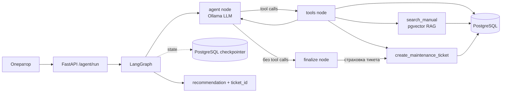

# Industrial Agent

LangGraph-агент для обслуживания промышленного оборудования. По сообщению
оператора агент определяет проблему, ищет код ошибки в технической
документации, анализирует историю ремонтов, проверяет склад запчастей,
создаёт maintenance ticket и возвращает рекомендацию.

## Архитектура



- **RAG**: Markdown-мануалы разбиваются на chunks, embedding-ся и хранятся в
  pgvector. Поиск поддерживает фильтр по `error_code`.
- **Инструменты**: `get_machine_info`, `search_manual`,
  `get_machine_history`, `check_spare_parts` и
  `create_maintenance_ticket`. Агент сам выбирает порядок вызовов.
- **Stateful**: `AsyncPostgresSaver` хранит состояние графа в PostgreSQL, а
  диалог продолжается по `thread_id`.
- **Страховка**: узел `finalize` создаёт тикет, даже если LLM не вызвал
  `create_maintenance_ticket`.

## Стек

- FastAPI и Uvicorn
- SQLAlchemy и PostgreSQL
- pgvector
- LangChain и LangGraph
- Ollama с OpenAI-compatible API
- Docker Compose

## Быстрый старт

Требуется Docker с Compose v2. Внешние API-ключи не нужны: модели запускаются
локально через Ollama.

```bash
cp .env.example .env
docker compose up --build -d
docker compose logs -f app
```

При первом запуске скачиваются Docker-образы и модели Ollama. После готовности
зависимостей `entrypoint.sh` автоматически выполняет:

```text
seed_data --if-empty
manual_index --if-missing
uvicorn app.main:app --host 0.0.0.0 --port 8000
```

Демо-данные содержат 50 машин, 350 записей истории, запчасти и 14 мануалов.
Повторные старты не пересоздают уже существующие данные и индекс.

## Проверка end-to-end

```bash
bash scripts/smoke_test.sh
```

Или запустите агента вручную:

```bash
curl -s http://localhost:8000/agent/run \
  -H 'Content-Type: application/json' \
  -d '{"message":"Conveyor Line 4 suddenly stopped. Error E142.","thread_id":"demo-1"}'
```

Для трассировки вызовов используйте SSE:

```bash
curl -N -X POST http://localhost:8000/agent/stream \
  -H 'Content-Type: application/json' \
  -d '{"message":"Conveyor Line 4 suddenly stopped. Error E142.","thread_id":"demo-2"}'
```

### Ожидаемый результат демо-сценария

Seed намеренно создаёт следующий сценарий:

| Шаг | Инструмент или результат | Факт из демо-данных |
|---:|---|---|
| 1 | `get_machine_info` | `Conveyor Line 4`, `Shop A`, `stopped` |
| 2 | `search_manual` | `E142`: перегрузка привода, причины и процедура устранения |
| 3 | `get_machine_history` | Три заранее заданных инцидента `E142` |
| 4 | `check_spare_parts` | `BLT-142` отсутствует на складе; связанные детали проверяются |
| 5 | `create_maintenance_ticket` | Создаётся тикет с `ticket_id` |
| 6 | Рекомендация | Диагноз, план работ, информация о запчастях и ссылка на тикет |

## Конфигурация LLM

По умолчанию `.env` настроен на Ollama:

```env
LLM_MODEL=llama3.1:8b
LLM_API_KEY=ollama
LLM_BASE_URL=http://localhost:11434/v1
EMBEDDINGS_MODEL=nomic-embed-text
EMBEDDINGS_API_KEY=ollama
EMBEDDINGS_BASE_URL=http://localhost:11434/v1
```

В Docker Compose адреса автоматически переопределяются на
`http://ollama:11434/v1`.

Для OpenAI или совместимого сервиса укажите, например:

```env
LLM_MODEL=gpt-4o-mini
LLM_API_KEY=sk-...
LLM_BASE_URL=
EMBEDDINGS_MODEL=text-embedding-3-small
EMBEDDINGS_API_KEY=sk-...
EMBEDDINGS_BASE_URL=
```

Подходят также Groq, OpenRouter и vLLM, если они предоставляют совместимые
эндпоинты для chat completions и embeddings.

## Локальный запуск без Docker

Нужны PostgreSQL с расширением pgvector на `localhost:5432` и Ollama с моделями
`llama3.1:8b` и `nomic-embed-text`.

```bash
python3 -m venv .venv
source .venv/bin/activate
pip install -r requirements.txt
python -m app.seed_data
python -m app.rag.manual_index
uvicorn app.main:app --reload
```

## API

| Метод | Путь | Назначение |
|---|---|---|
| `GET` | `/health` | Статус приложения |
| `POST` | `/agent/run` | Запуск агента, рекомендация и `ticket_id` |
| `POST` | `/agent/stream` | SSE-поток tool calls и результатов |
| `GET` | `/machines` | Список машин |
| `GET` | `/spare_parts` | Остатки на складе |
| `GET` | `/tickets` | Созданные maintenance tickets |

## Troubleshooting

| Симптом | Решение |
|---|---|
| Первый `docker compose up` долгий | Скачиваются образы и модели Ollama; прогресс смотрите через `docker compose logs ollama` |
| LLM не вызывает инструменты | Попробуйте модель со стабильным tool-calling, например `qwen2.5:7b` или облачную модель; fallback в `finalize` всё равно создаст тикет |
| Ошибка размерности embeddings | Смените embedding-модель и пересоздайте индекс: `docker compose exec app python -m app.rag.manual_index` |
| `connection refused` к БД | Проверьте `docker compose ps`; сервис `db` должен быть healthy |
| Порт 8000 занят | Измените mapping `ports` в `docker-compose.yml` и задайте `BASE` для smoke-теста |
| Нужно пересоздать данные | Выполните `docker compose exec app python -m app.seed_data` без `--if-empty` |

## Known limitations

- Локальный `llama3.1:8b` через Ollama на CPU генерирует ~5 токенов/сек, поэтому
  полный ответ `/agent/run` или `/agent/stream` (5 tool calls + рекомендация)
  может занимать 1-3 минуты. Для более быстрых ответов используйте GPU-хост или
  облачную модель (см. раздел «Конфигурация LLM»).
- Для машины или кода ошибки, которых нет в БД/документации, агент явно сообщает
  об этом и не создаёт тикет для несуществующей машины (`ticket_id` остаётся
  `null`); для реальной машины с неизвестным кодом ошибки тикет создаётся на
  основе фактических данных из истории и склада.
